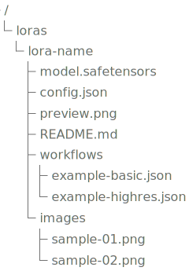
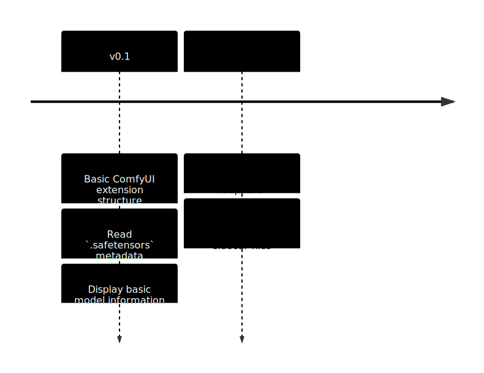

<h1 align="center"> 🗃️ safetensors-extra-data 🗃️ </h1>

  
  
  

  
  
  
  
  

A ComfyUI extension for convenient work with `.safetensors` files. The emphasis is on additional information: previews, metadata, documentation, etc.

## Overview

The project was created to provide more information about stored models. Documentation should be maintained in the same directory as the model. The model should be exportable along with its associated data.

## Features

<!-- PLACEHOLDER -->

## Screenshots

<table>
  <tr>
    <td></td>
    <td></td>
  </tr>
</table>

## Installation

<!-- PLACEHOLDER -->

## Usage

  

## Project Structure

<!-- PLACEHOLDER -->

## Configuration

<!-- PLACEHOLDER -->

## Development

<!-- PLACEHOLDER -->

## Roadmap

## Development Board

## Contributing

Contributions are welcome.

You can help by:
- reporting bugs;
- suggesting new features;
- improving documentation;
- testing the extension with different `.safetensors` models;
- submitting pull requests.

Before making large changes, please open an issue first to discuss the idea.

## License

This project is licensed under the terms of the license included in the repository.

See the LICENSE file for details.

## Credits

Created by [TimCixo](https://github.com/TimCixo).

Built for the ComfyUI community and for easier work with .safetensors model-related data.